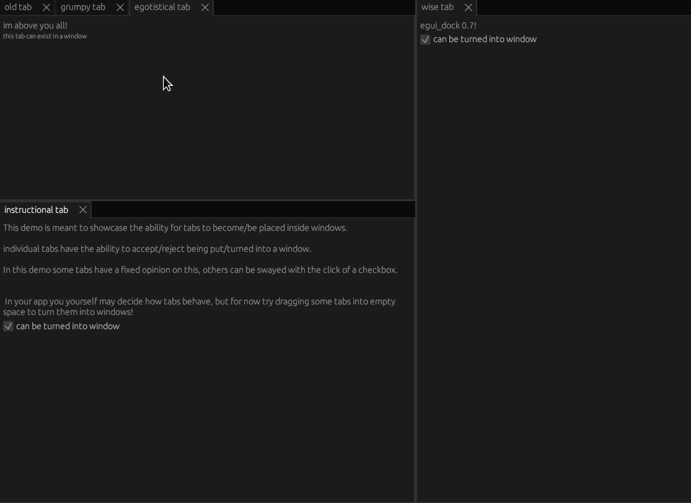

# `egui_dock`: docking support for [egui](https://github.com/emilk/egui)

[](https://github.com/emilk/egui)
[](https://crates.io/crates/egui_dock)
[](https://docs.rs/egui_dock/)

Credit goes to [@Iain-dono](https://github.com/lain-dono) for implementing the actual library.

This fork aims to provide documentation and further development if necessary.

## Demo



## Usage

First, create your context type and your tab widget:

```rust
use egui::{Frame, Ui, style::Margin};
use egui_dock::Tab;

struct MyContext;

struct MyTab {
    text: String,
}

impl MyTab {
    fn new(text: impl ToString) -> Self {
        Self {
            text: text.to_string(),
        }
    }
}

impl Tab<MyContext> for MyTab {
    fn title(&self) -> &str {
        &self.title
    }

    fn ui(&mut self, ui: &mut Ui, _ctx: &mut MyContext) {
        let margin = Margin::same(4.0);

        Frame::none().inner_margin(margin).show(ui, |ui| {
            ui.label(&self.text);
        });
    }
}
```

Then construct the initial tree using your tab widget:

```rust
use egui::style::Margin;
use egui_dock::{TabBuilder, Tree};

let tab1 = TabBuilder::default()
    .title("Tab 1")
    .content(|ui| {
        ui.label("Tab 1");
    })
    .build();
let tab2 = TabBuilder::default()
    .title("Tab 2")
    .inner_margin(Margin::same(4.0))
    .content(|ui| {
        ui.label("Tab 2");
    })
    .build();

let mut tree = Tree::new(vec![tab1, tab2]);
```

Finally, you can show the tree.

```rust
let id = ui.id();
egui_dock::show(&mut ui, id, &style, &mut tree);
```

## Contribution

Feel free to open issues and pull requests.
